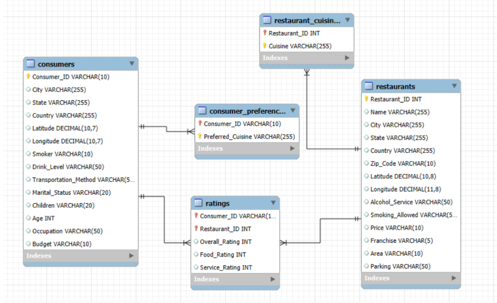

# Restaurant Consumer Data Analysis (SQL Project)

## 📌 Project Overview

This project analyzes restaurant consumer data to understand customer preferences, restaurant performance, and demographic behavior.

The database contains information about consumers, restaurants, cuisines, and ratings. Using SQL queries, the project extracts insights that help understand customer dining patterns and restaurant popularity.

The goal is to demonstrate advanced SQL skills including joins, group by analysis, indexing, triggers, subqueries, and stored procedures.

---

## 🗄 Database Schema

The project database consists of the following tables:

**Consumers**

* Stores customer demographic information such as age, occupation, budget, and lifestyle attributes.

**Restaurants**

* Contains restaurant details including location, pricing, services, and facilities.

**Ratings**

* Stores customer ratings for restaurants including overall rating, food rating, and service rating.

**Restaurant_Cuisines**

* Contains cuisine types offered by restaurants.

**Consumer_Preferences**

* Stores preferred cuisines of consumers.

---

## 🧩 Entity Relationship (ER) Diagram

The ER diagram illustrates relationships between consumers, restaurants, cuisines, and ratings.

Key relationships include:

* One consumer can rate multiple restaurants.
* One restaurant can receive ratings from many consumers.
* Restaurants can serve multiple cuisines.
* Consumers can have multiple cuisine preferences.

---

## 🛠 SQL Concepts Used

### Joins

Used to combine multiple tables for analysis.

Examples:

* Consumer ratings with restaurant details
* Consumer preferences with restaurant cuisines

Types used:

* INNER JOIN
* LEFT JOIN

---

### GROUP BY & Aggregations

Used for analyzing trends and patterns.

Examples:

* Average ratings for restaurants
* Number of consumers by city
* Budget distribution of consumers

Functions used:

* COUNT()
* AVG()
* SUM()

---

### Subqueries

Used to filter results based on another query.

Examples:

* Restaurants with above-average ratings
* Consumers who rated multiple restaurants

---

### Indexes

Indexes were created on important columns to improve query performance.

Examples:

* Index on Consumer_ID
* Index on Restaurant_ID

---

### Triggers

Triggers were implemented to automate actions in the database.

Example:

* Validate rating values before inserting records.

---

### Stored Procedures

Stored procedures were used to automate complex analytical queries.

Examples:

* Retrieve top-rated restaurants
* Analyze cuisine popularity

---

## 📊 Example Analysis Performed

The project answers several analytical questions:

* Which restaurants have the highest ratings?
* Which cuisines are most popular among consumers?
* What budget category is most common among consumers?
* Which cities have the most restaurant activity?
* What factors influence restaurant ratings?

---

## 🚀 Skills Demonstrated

* SQL Database Design
* ER Modeling
* Joins
* Aggregations
* Subqueries
* Index Optimization
* Triggers
* Stored Procedures
* Data Analysis using SQL

---

## 👨‍💻 Author

Vamsi Vaka
B.Tech – Artificial Intelligence & Machine Learning
Aspiring Data Analyst
